# flutter_uts

Kelompok : 2  
Nama Kelompok : Dragoyang  
Ketua Kelompok : Muhammad Abdiel Firjatullah  
Anggota Kelompok :  
1). Moch. Rofiqi  
2). Mochammad Rafly Herdianto  
Judul Aplikasi : Task Management  
Kelas : MI - 2C

## Report Progress

    

    

    

    

    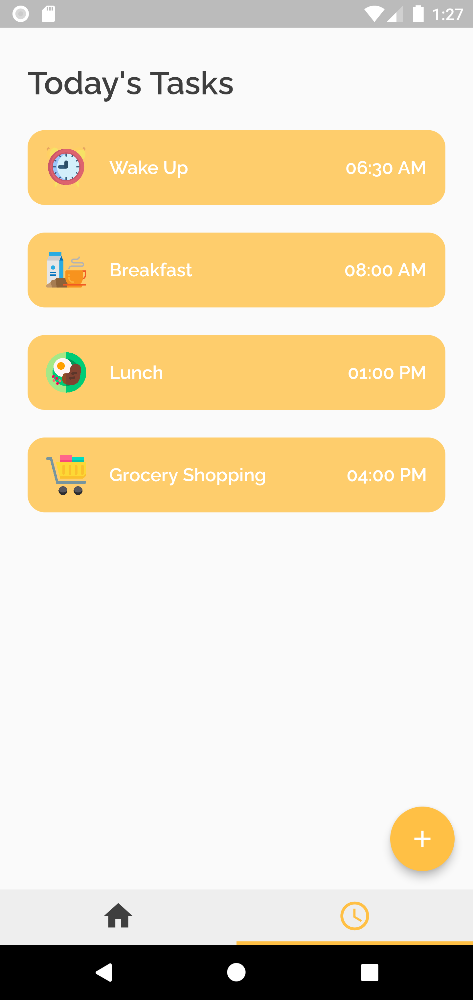

    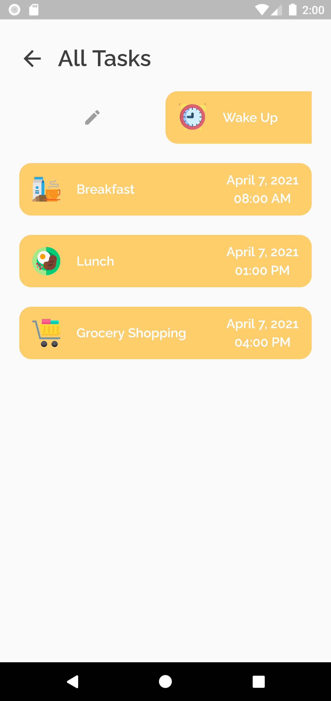

    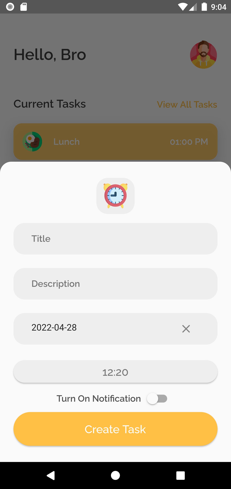

    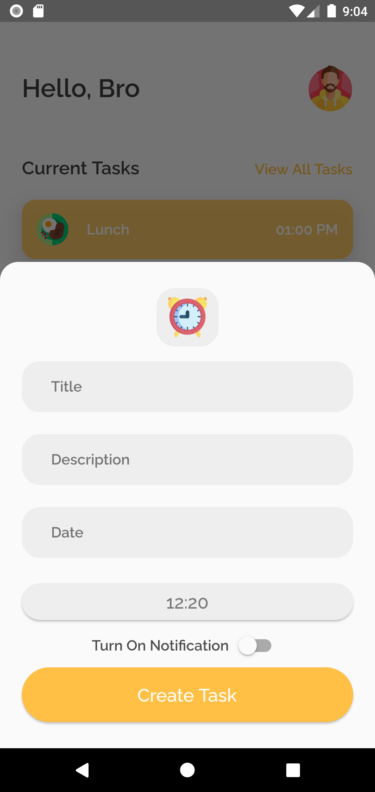

    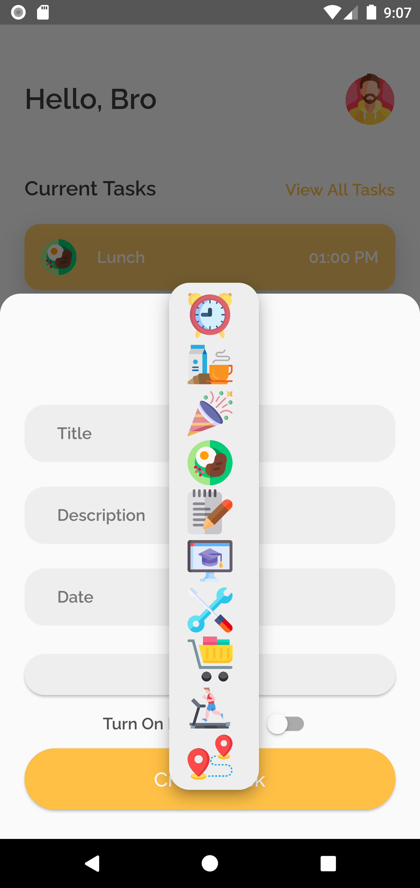

    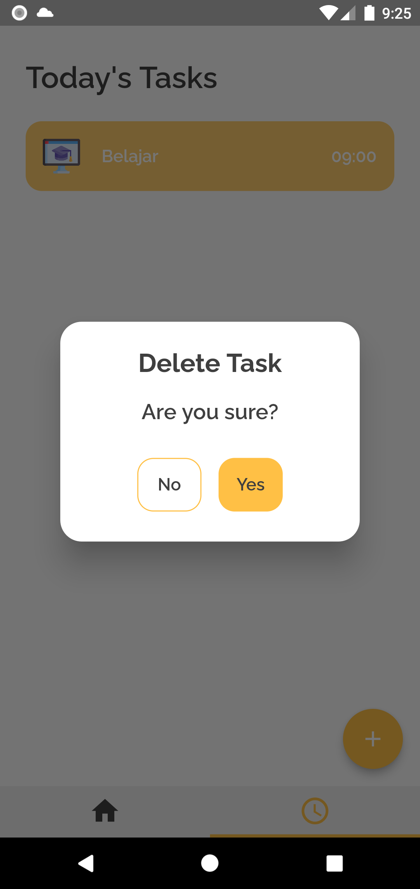

    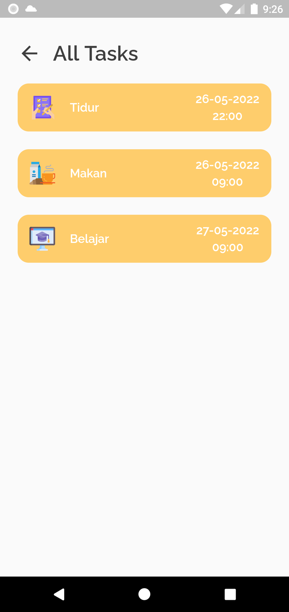

    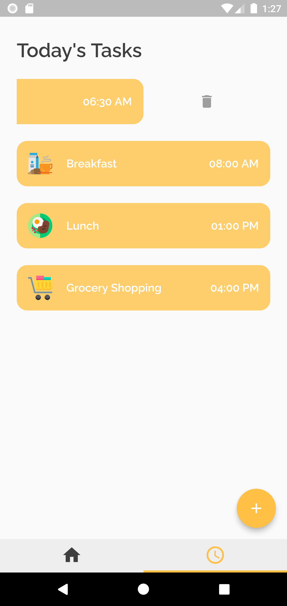

    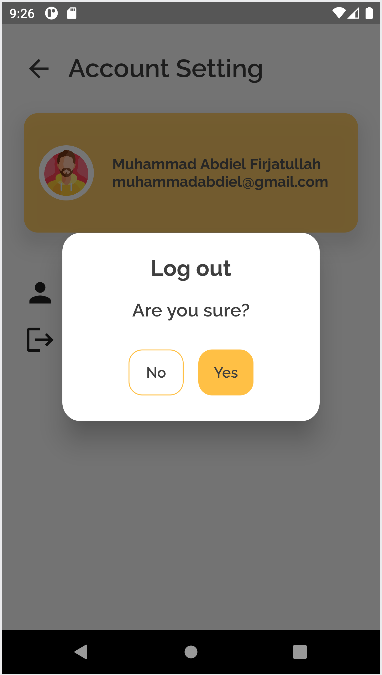

    

    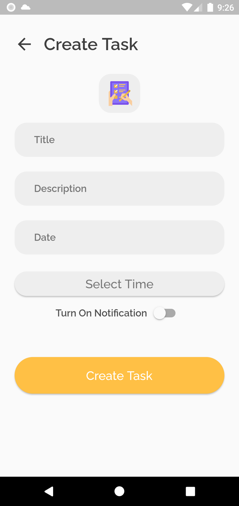

    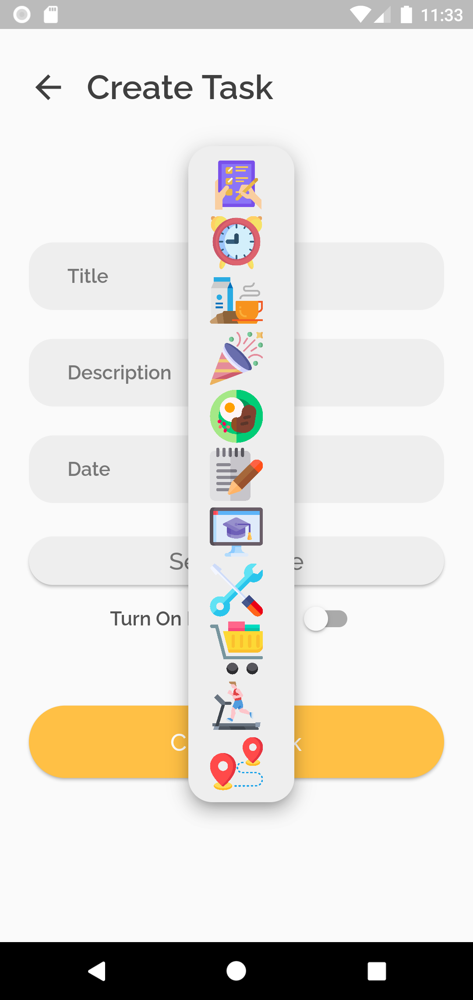

    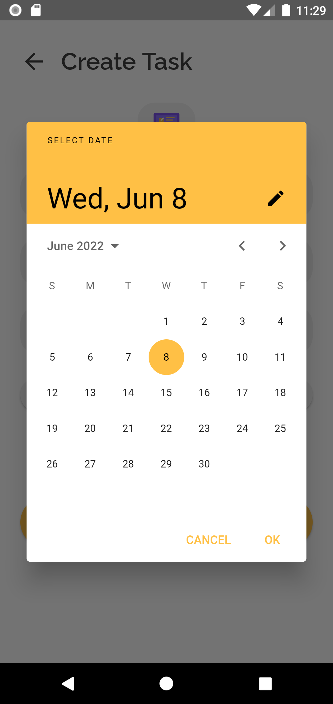

    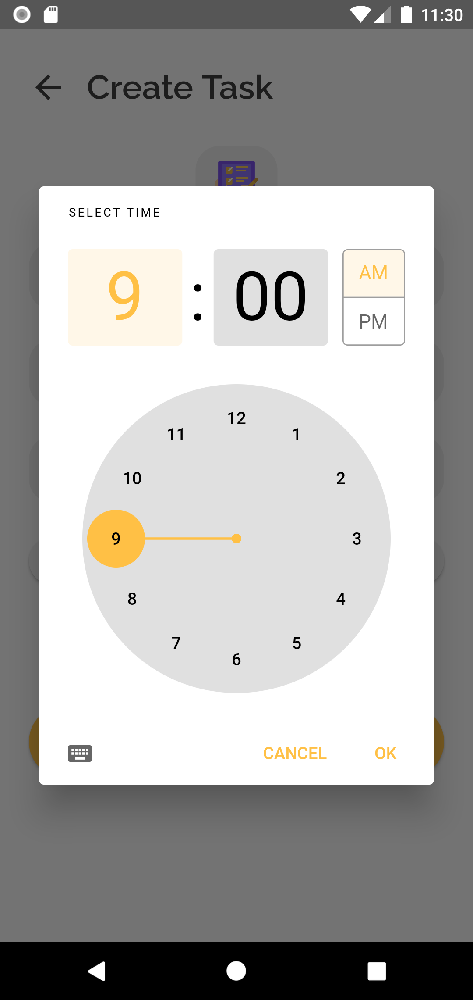

    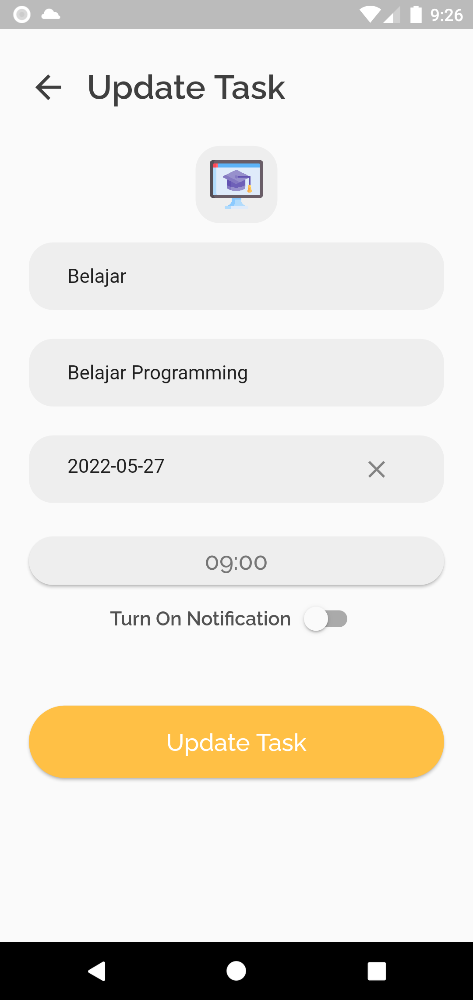

    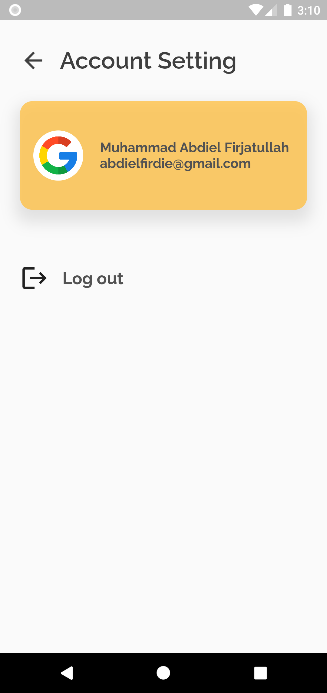

    

    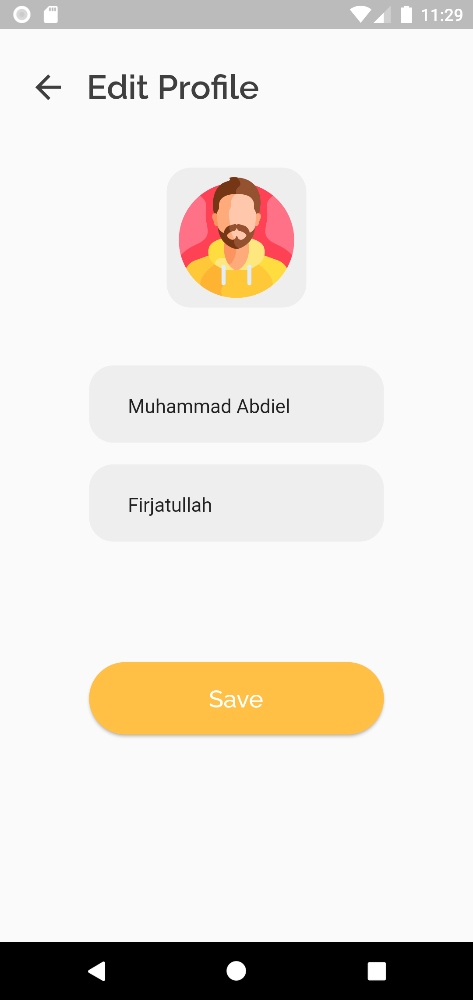

    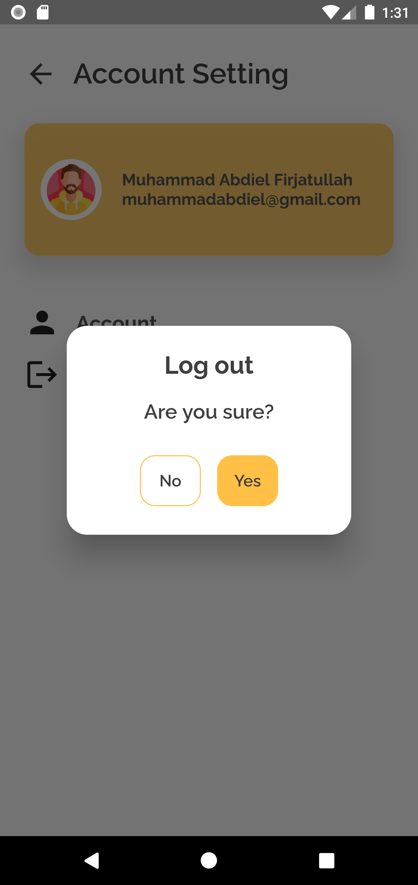

<a href="https://www.figma.com/proto/lCaX0iwxY5zFsP26M7WF9o/Untitled?node-id=46%3A22&scaling=scale-down&page-id=0%3A1&starting-point-node-id=46%3A2">Prototype Figma</a>

    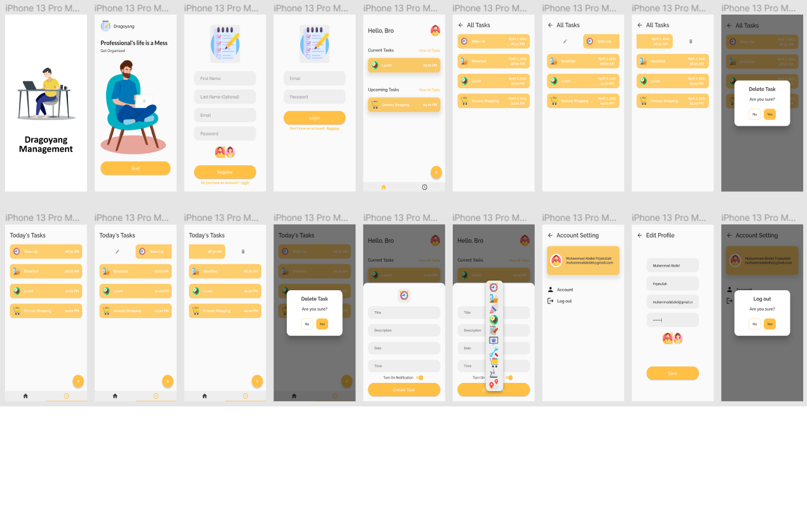

