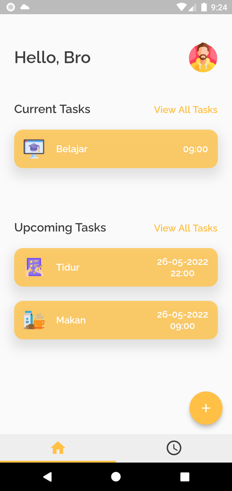
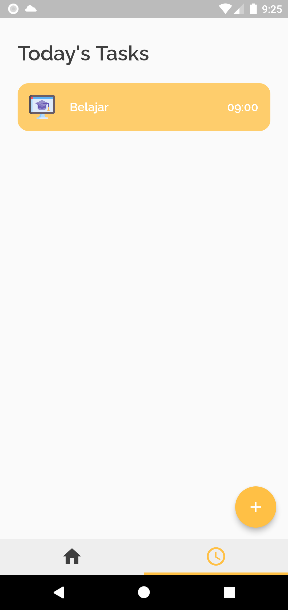
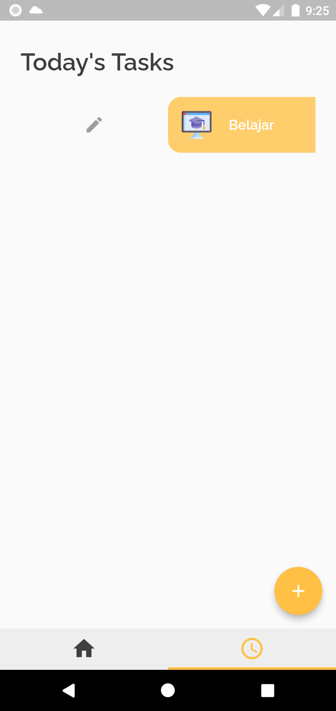
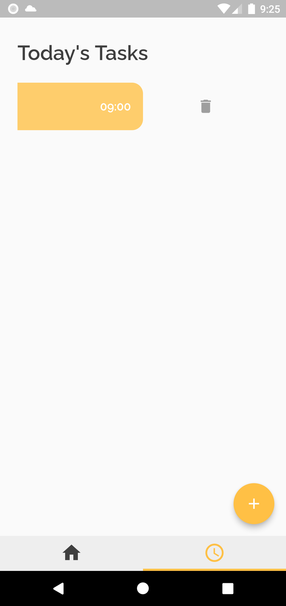
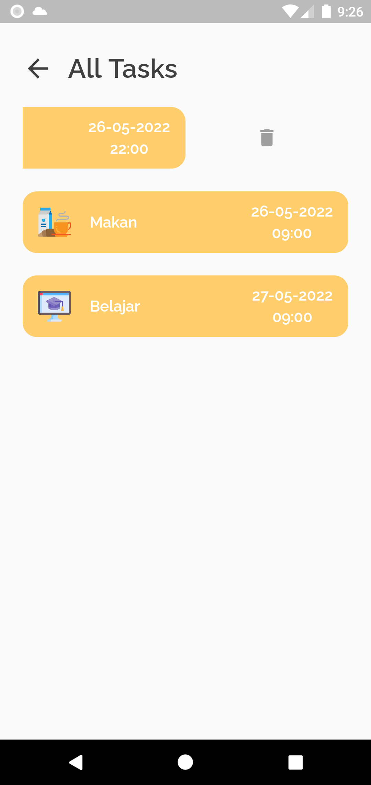
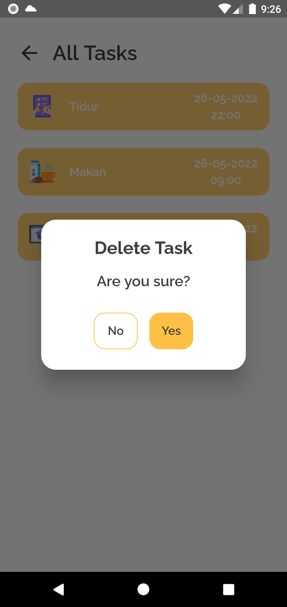

# flutter_uts

Kelompok : 2  
Nama Kelompok : Dragoyang  
Ketua Kelompok : Muhammad Abdiel Firjatullah  
Anggota Kelompok :  
1). Moch. Rofiqi  
2). Mochammad Rafly Herdianto  
Judul Aplikasi : Task Management  
Kelas : MI - 2C

## Report Progress

    

    

    

    

    

    

    

    

    

    

    

    

    

    

    

    

